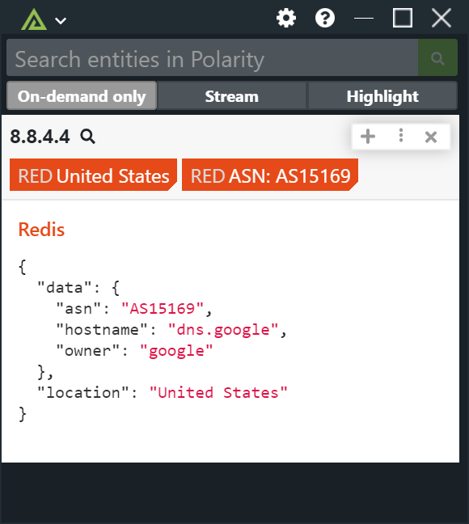

# Polarity Redis Server Integration

  

## Overview

The Redis integration provides a generic method for querying Redis (including Elasticache for Redis).  The integration issues a simple `GET` request for a configured key pattern and will return the value to display in the Overlay Window.

The integration supports key values that are properly formatted JSON as well as plain strings.  

|  |
|----|
|*(Example key-value pair in Redis with JSON formatting)*|

If the value is JSON, the integration will display the output as a formatted JSON object, or in a tabular format.  If the value is a simple string then the string will be displayed.

For JSON objects the integration supports specifying which keys should be used as summary tags as well as specifying labels for those keys.

## Options

### Host

The hostname of the server hosting your Redis instance.  This option should be set to "Only Admins can view and edit".

### Redis Port

The port your Redis instance is listening on.  Defaults to 6379.  This option should be set to "Only Admins can view and edit".

### Redis Database

The Redis database you are connecting to. Defaults to 0. This option should be set to "Only Admins can view and edit".

### Authentication Password

If provided, the integration will first authenticate to your Redis instance as the "default" user via the provided password. If left blank, no authentication will be used. The integration does not currently support Redis ACLs. This option should be set to "Only Admins can view and edit".

### Redis Key Pattern

The Redis key pattern you wish to lookup. The string "{{entity}}" will be replaced by the entity value being looked up.

### Value is JSON

If checked, the integration will assume the value of the key is a properly formatted JSON object. If not checked, the integration treats the value as a string.

### Summary Tags

If the "Value is JSON" option is checked, then you can use this option to specify the JSON keys that should be displayed as summary tags. Provide a comma delimited list of keys (JSON dot notation is supported). To add labels to the keys, format the key as "<label>:<key>".

### View JSON as Table

If checked and the "Value is JSON" option is enabled, the JSON will be displayed as a table. If not checked, the JSON will be displayed as a JSON object.

### Enable TLS

If checked, the integration will attempt to connect to your Redis instance over TLS (supported from Redis version 6 onward). See https://redis.io/topics/encryption for more information. This option should be set to "Only Admins can view and edit".

## Installation Instructions

Installation instructions for integrations are provided on the [PolarityIO GitHub Page](https://polarityio.github.io/).

## Polarity

Polarity is a memory-augmentation platform that improves and accelerates analyst decision making.  For more information about the Polarity platform please see:

https://polarity.io/
